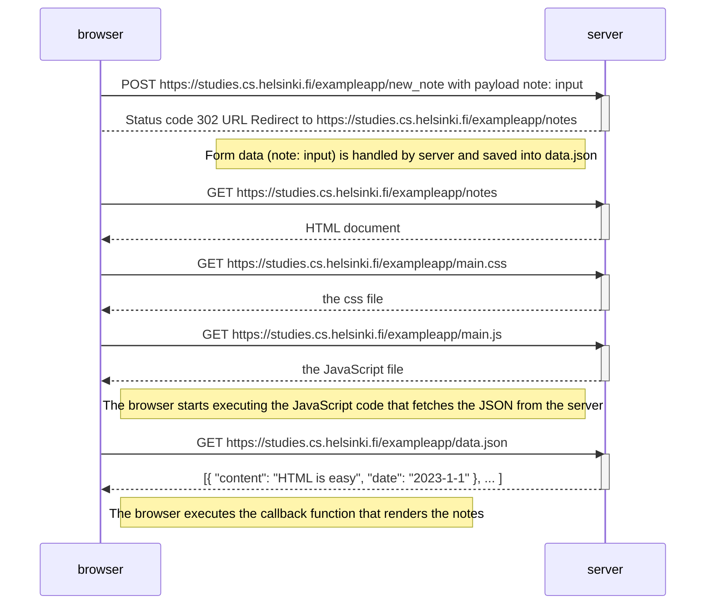
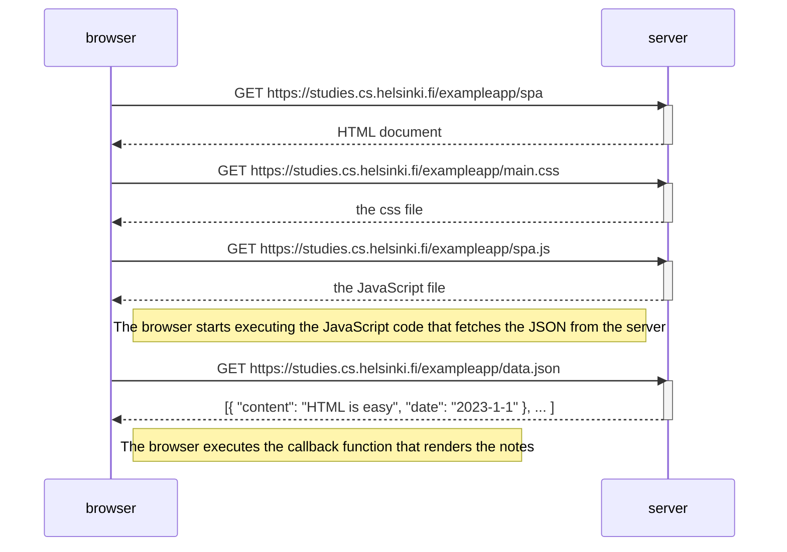
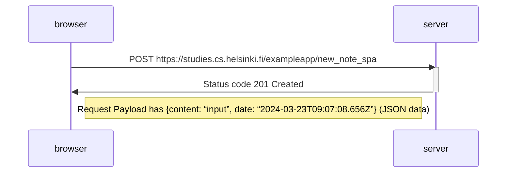

## Exercise 0.4: New note diagram

## Exercise 0.5: Single-page app diagram

Similar to the more traditional one but HTML and JavaScript files are different. In HTML form is defined in a different way.

## Exercise 0.6: New note in single-page app diagram

